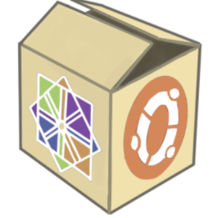

<p align="center">
	
</p>
<h1 align="center"> CBox </h1>
<p align="center">Container Box，一个类似 Docker 的容器管理系统</p>
<p align="center"><a href="#支持的功能">支持的功能</a> | <a href="#使用方式">使用方式</a> | <a href="#其他说明">其他说明</a> | <a href="#杂谈">杂谈</a></p>

# 支持的功能

- 从镜像站下载镜像到本地
- 根据已有镜像构建新的镜像，Dockerfile 解析器对错误语法的提示精确到行
- 创建并操作由 Namespace 和 CGroups 隔离的容器
- 容器与宿主机间进行文件的复制或数据卷的挂载
- 容器与宿主机间网络栈的隔离与网络包的互通
- 使用多种方式创建容器的 rootfs，当前支持 overlay2 和自定义的 raw_copy
- 由镜像定义的心跳检查任务（非标准）
- 分组配置容器使用的资源

# 使用方式

## 命令

> 系统在运行时可以通过传递 `--root_dir` 来指定一个目录作为运行时的根目录，下面所有操作都仅发生在被指定的目录中，默认使用 `$HOME/cbox-dir` 目录

| 命令名  | 命令解释                                                     |
| ------- | ------------------------------------------------------------ |
| help    | 显示帮助信息                                                 |
| create  | 根据镜像创建容器                                             |
| start   | 启动创建的容器                                               |
| exec    | 在容器环境下执行命令，默认执行 Entrypoint，可传递新的命令覆盖 |
| cp      | 在容器与宿主机间复制文件或文件夹                             |
| stop    | 停止已经启动的容器                                           |
| inspect | 显示容器的详细信息                                           |
| rm      | 删除一个已经停止的容器                                       |
| ps      | 以表格的形式列出已创建的所有容器                             |
| pull    | 从镜像站拉取镜像到本地                                       |
| build   | 根据构建文件来构建新的镜像，默认使用 JSON 文件，可通过 flag 控制使用 Dockerfile |
| images  | 列出本地的所有镜像                                           |
| rmi     | 删除本地未被使用的镜像                                       |

## flags

> 以下的所有 flag 都是全局的（为了偷懒:-P），所以使用时的方式为 `cbox <flag> <命令>`

| 参数名         | 参数解释                                                     |
| -------------- | ------------------------------------------------------------ |
| debug          | 以调试模式运行，会在出错时输出调用栈，且平时的所有输出都会显示代码行数 |
| root_dir       | 指明宿主机上的一个目录作为根目录，默认使用 `$HOME/cbox-dir` ，对所有命令生效 |
| storage_driver | 声明使用什么存储驱动，当前支持 `raw_copy` 与 `overlay2`，默认使用 `raw_copy`，对 create/start/stop 命令生效 |
| dns_file_path  | 指明一个宿主机上的文件作为容器的 DNS NameServer 文件，对 start/run 命令生效 |
| use-dockerfile | 使用 Dockerfile 而不是 JSON 文件来构建镜像，对 build 命令生效 |
| volume         | 声明容器使用的数据卷，其中一个数据卷的格式为 `<宿主机目录>:<容器目录>`，可使用半角逗号分隔多个数据卷，宿主机目录可使用相对路径，容器目录需要是绝对路径，对 create/run 命令生效 |
| cpu            | 声明容器使用的 cpu 核数，整型，传递 -1 表示不限制，对 start/run 命令生效 |
| mem            | 声明容器使用的最大内存，整型，单位 MiB，对 start/run 命令生效 |
| task           | 声明容器内的最大线程数，整型，传递 -1 表示不限制，对 start/run 命令生效 |

# 其他说明

## 配置文件说明

每个根目录（由 `--root_dir` 参数指定）中有一个 config.json 文件，其中的内容如下：

```shell
➜  cbox git:(main) cat ~/cbox-dir/config.json
{
  "storage_driver": "raw_copy", // 当前根目录中的所有容器默认使用的存储驱动
  "dns_file_path": "/etc/resolv.conf", // 当前根目录中的所有容器默认使用的 DNS NameServer 文件
  "cgroup": {
    "enable": true, // 是否启动 CGroups 功能
    "name": "cbox", // 当前根目录的 CGroups 名
    "cpu_cgroup_path": "/sys/fs/cgroup/cpu", // 宿主机中 cpu subsystem 的挂载点
    "cpu_limit": -1, // 当前根目录中的所有容器可以使用的最大 cpu 核数
    "mem_cgroup_path": "/sys/fs/cgroup/memory", // 宿主机中 memory subsystem 的挂载点
    "mem_limit": 4096, // 当前根目录中的所有容器可以使用的最大内存总量，单位 MiB
    "pid_cgroup_path": "/sys/fs/cgroup/pids", // 宿主机中 pids subsystem 的挂载点
    "task_limit": -1 // 当前根目录中的所有容器中最多有多少个线程
  },
  "network": {
    "enable": true, // 是否启动网络隔离
    "name": "cbox0", // 网桥的名字
    "bridge_cidr": "172.29.0.1/16", // 网桥的地址
    "ip_range": { // 当前根目录中的所有容器可用的 ip 地址池
      "start": "172.29.0.150/16",
      "end": "172.29.0.200/16"
    }
  }
}
```

## 镜像构建文件说明

系统支持使用 Dockerfile 或 JSON 文件作为构建文件，需要注意的是，**系统在执行构建时先执行所有的 COPY，再执行所有的 RUN**

### Dockerfile

系统支持的所有 Dockerfile 指令，和 Docker 的不同在于自定义了 NAME 命令用于声明镜像的名字

```dockerfile
FROM alpine:latest

# 环境变量 KEY0 的内容为 VAL
ENV KEY0 VAL

# 环境变量 KEY1 的内容为 this is key1 env（没有引号）
# 暂不支持处理双引号内容中的命令或环境变量
ENV KEY1 "this is key1 env"

# 环境变量 KEY2 的内容为 this is key2 env（没有引号）
ENV KEY2 'this is key2 env'

# RUN 命令可以使用 \ 和 &&
RUN touch file-from-touch \
&& echo "file content 1" > file-from-touch

# 也可以重复使用 RUN 来声明多个指令
RUN echo "file content 2" >> file-from-touch

# 第一个参数是宿主机目录，第二个参数是容器目录
COPY . /cbox-src

# 支持三个 option，默认值同 docker
# CMD 后面的语法与 RUN 命令相同
HEALTHCHECK --interval=5 --timeout=10 --retries=3 CMD \
echo healthy >> health-check

# ENTRYPOINT 不支持使用 && 来连接多个命令
ENTRYPOINT cat file-from-touch

# 这是一个扩展语句，用于直接声明构建的镜像的名字
NAME my-image
```

### JSON

JSON 文件大体与 Dockerfile 相同，但 RUN 命令都被定义在 cmds 里

```shell
{
	"from": "alpine",
	"env": {
		"KEY": "VAL"
	},
	"copy": [
		{
			"src": ".",
			"dst": "/cbox-src"
		}
	],
	"cmds": [
		["touch", "file-from-touch"],
		["echo", "file content", ">", "file-from-touch"]
	],
	"entrypoint": ["sh"],
	"name": "my-image",
	"health_check": {
		"interval": 5,
		"timeout": 10,
		"retries": 3,
		"cmd": ["echo", "healthy", ">>", "health-check"]
	}
}
```

# 杂谈

- 系统以学习为主要目的，故在错误处理方面存在诸多不足
- 系统没有处理 whiteout 文件与 oppacity 文件夹，因此不支持有文件删除操作的多层镜像
- 技术不佳，欢迎提交 issue 和 PR 进行交流 :-)